# Creative Spaces
(Developer: Ulrike Riemenschneider)

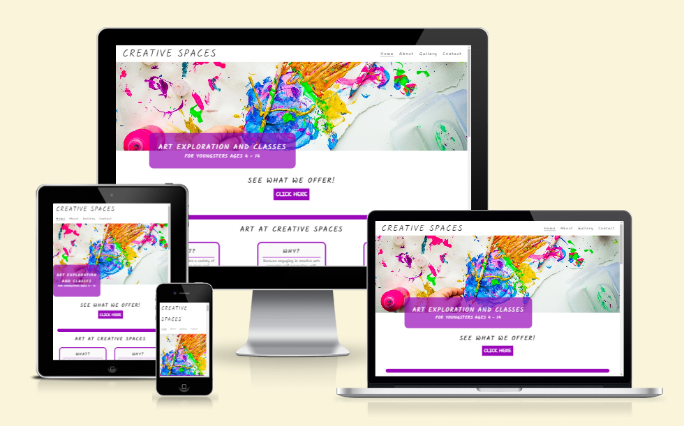

[Live webpage](https://uriem.github.io/art-school/index.html)

## Table of Content

1. [Introduction](#introduction)
2. [Project Goals](#project-goals)
    1. [User Goals](#user-goals)
    2. [Site Owner Goals](#site-owner-goals)
3. [User Experience](#user-experience)
    1. [Strategy](#strategy)
        * [Target Audience](#target-audience)
        * [User Requirements & Expectations](#user-requirements-and-expectations)
        * [User Stories](#user-stories)
    2. [Scope](#scope)
        * [Initial Stage](#intial-stage)
        * [Future Additions](#future-additions)
    3. [Structure](#structure)
        * [Wireframes](#wireframes)
    4. [Skeleton](#skeleton)
        * [Header](#header)
        * [Footer](#footer)
        * [Services offered](#services-offered)
        * [Calls to action](#call-to-action)
        * [About page](#about-page)
        * [Contact page](#contact-page)
        * [Gallery and Images](#gallery-page-and-images)
        * [Future Additions](#future-additions)
    5. [Surface](#surface)
        * [Color Scheme](#color-scheme)
        * [Font](#font)
4. [Technologies Used](#technologies-used)
    1. [Language](#languages)
    2. [Frameworks & Tools](#frameworks--tools)
5. [Testing and Validation](#testing-and-validation)
    1. [HTML](#html-validation)
    2. [CSS](#css-validation)
    3. [Accessibility & Performance](#accessibility--performance)
    4. [Browser Compatability](#browser-compatability)
    5. [User Stories](#user-stories)
6. [Bugs](#bugs-fixes-and-outstanding-issues)
7. [Deployment & Development](#deployment--development)
8. [Credits](#credits)

## Introduction

Creative Spaces is an art space and school in the Ratzeburg, Germany, area offering classes for children ages 4 - 14. The site is targeted towards parents who are looking for their children to expand and develop their creative abilities. The space offers special events as well such as birthday parties and summer camps.

## Project Goals

### User Goals
- Find an open, inviting and versitile art space for children in Ratzeburg, Germany.
- Find guided art classes for children.
- Find a open art exploration space for children.
- Become part of a community of like-minded children and parents of artistially inclined children.

### Site Owner Goals
- Attract parents and their children to the creative space.
- Increase numbers of students participating in the space.
- Promote art as an invaluable developmental tool for children.
- Teach and promote artistic skills.
- Fascilitate a space for social interactions and bonding.

## User Experience

### Strategy

#### Target Audience
- Parents looking to enroll their children in art classes
- Parents looking to find an artistic outlet for their children.
- School age children looking for a creative space to expand their artistic skills.

#### User Requirements and Expectations
- Simple and intuitive navigation system.
- Find relevant information easily and quickly.
- Links work as expected.
- Easy was to contact the business.
- Visually appealing responsive design.
- Accessibility.

#### User Stories

##### First-time User
As a first time user, I want to ...
1. ... know what services are offered at Creative Spaces.
2. ... know times, locations, and types of classes offered.
3. ... know how to get in contact with the business and request more information.
4. ... find more information about the staff mentoring and supervising the children.
5. ... get a feel for what to expect from the classes and fascilities.

##### Returning Users
As a returning user, I want to ...
1. ... see the times and types of classes offered.
2. ... see if there is any new classes offered.
3. ... find social media links to connect with the business.
4. ... find directions to the location of the business.

##### Site owner
As the site owner, I want users to ...
1. ... interact with the space, learn about the space, learn about the services offered, learn about the benefits of the service, and sign up for more information.
2. ... feel comfortable and at ease reaching out for more information.

### Scope

#### Intial Stage

At the initial stage the site will include the basic relevant information. It will include information on the art school and it's motivating principles. It will include a list of classes offered. It will communicate to the user the experience and trustworthyness of the staff running the space. It will make contacting the school easy and promote an approachabe image. The site will include a picture gallery full of impressions of the space and it's operations.

#### Future Additions

In future expansion the site could include a more detailed area for news and special events, such as summer camps, and art exhibits, and a pricing structure of the services offered. 

### Structure

#### Wireframes

The structure of the initial site will include four pages:

1. **Home Page** with navigation features in a header and footer, a section on the motivations and philosphy of the space, a section on the classes offered and information on location.

2. **About Page** with information on the staff and more details about the classes/spaces they fascilitate. This page will include the same header and footer as the main page.

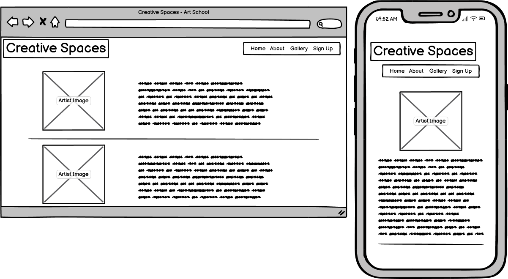

3. **Contact Page** with a detailed form that includes name and email fields, as well as details on the users interest in the space and the age of the child who is considering use of the space. There will be a field for a text message as well.

4. **Gallery Page** with a wealth of images that will give a feel and impression of the space.

### Skeleton

As described in the previous section with the aid of wireframes, the website includes for pages, which all have a consistent header and footer. The home page includes several calls to action, which link to the about page and the contact page. The gallery has an interactive caption feature. Here are more details of the various page features:

#### Header

Screenshot of header on desktop

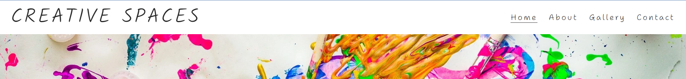

Screenshot of header on mobile

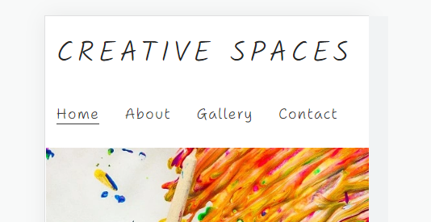

- Featured on all five pages.
- Includes the company name/logo and a menue with links to the Homepage, About page, Gallery page and Contact page.
- The header is fully responsive and changes to fill two lines on smaller screens.
- If a user hovers over a menu option in desktop mode an animated bar shows them which option they are choosing. 

#### Footer

Screenshot of Footer

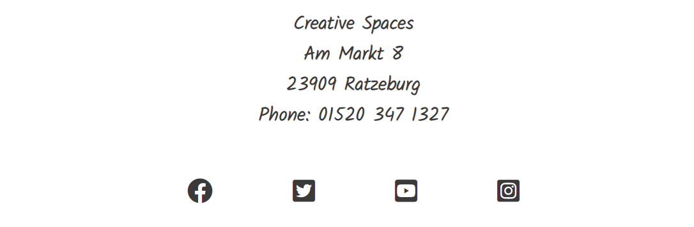

Screenshot of footer on mobile

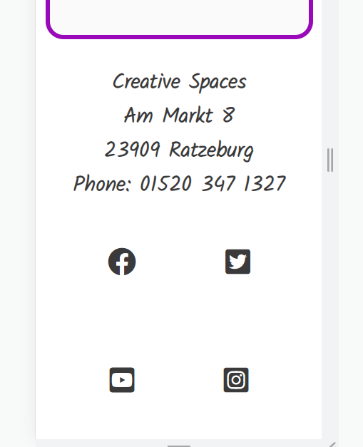

- Featured on all five pages.
- Includes links to the Homepage, About page, Gallery page and Contact page.
- The navbar is fully responsive and changes to fill two lines on smaller screens.
- If a user hovers over a nav bar option in desktop mode an animated bar shows them which option they are choosing. 

#### Services offered

Screenshot of Services offered

- Four panels detail the services/classes offered at the art school.
- Age groups and class times are specified.
- A call to action for more information is included in each panel.

#### Call to action

Screenshot of calls to action

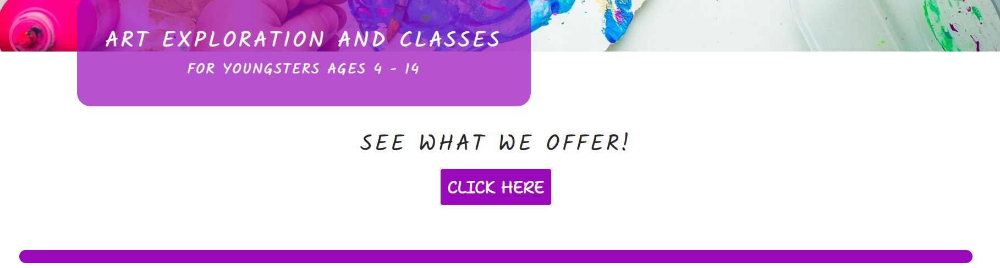

- A call to action features immediately below the hero image. It links to the services offered section.
- The call to action buttons in the panels for the classes offered link to about page and specifically the teacher running that class.
- The call to action button in the special events panel links to the contact page.

#### About page

Screenshot of About page

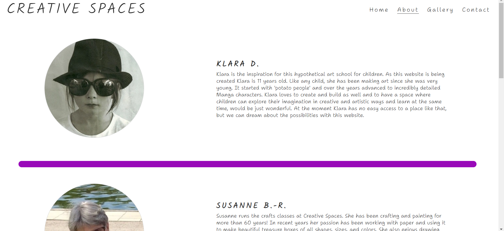

- Features four images with information on each member of staff with a short biography and information on the class.

#### Contact page

Screenshot of Conact page top

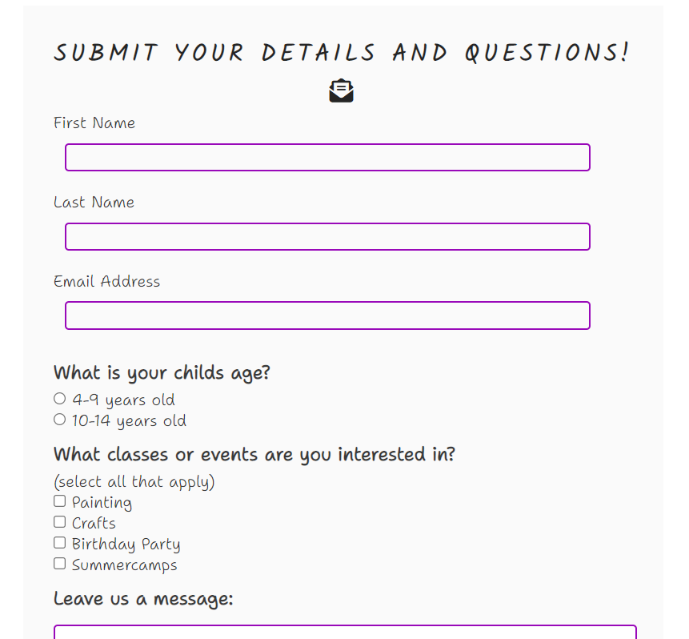

Screenshot of Conact page bottom

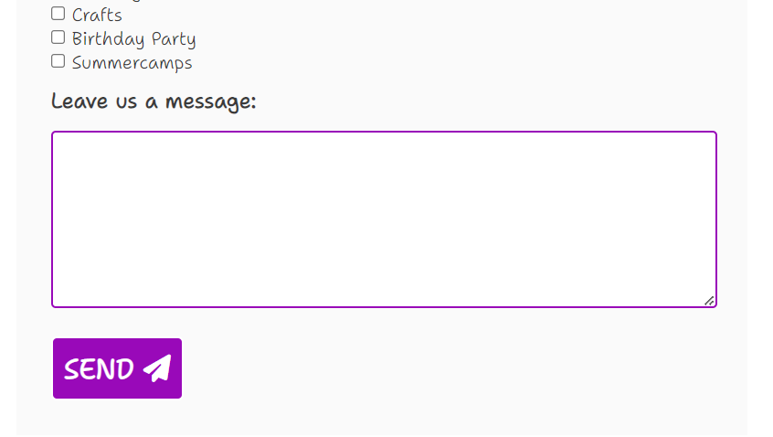

- Features a detailed form that a customer can submit to express specific interest and request more information.

#### Gallery page and Images

Screenshot of Gallery page

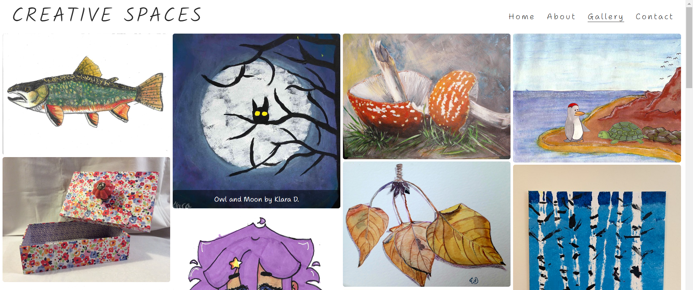

- Features artwork by the four members of staff listed on the about page. 
- If the user hovers over the image a superimposed caption appears on each image.

#### Future Additions

A feature to be implemented in the future is a map with the location of the school at the bottom of the home page.

### Surface

The surface design of the website is aimed to convey an artistic flair, while remaining uncluttered, and maintaining easy of readability. The color schemes and font were chosen accordingly.

#### Color Scheme

The color scheme is a balance of vibrant colors that draw attention and convey artistic energy. A vibrant purple color was chosen in conjunction with the hero image and a desire for them to blend together. The remaining features on the site and font are a balance of a dark grey or black, as well as white or off white in order to maintain contrast and readability.

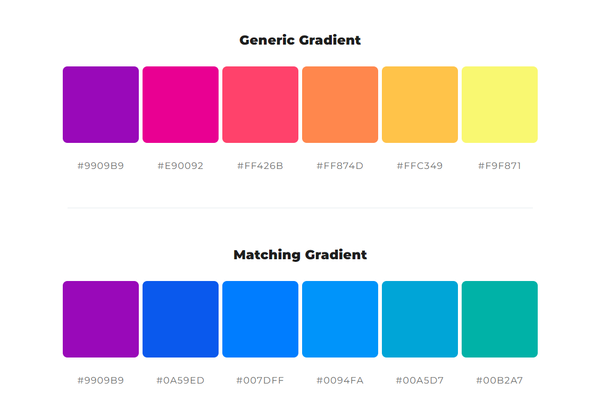

#### Font

Kalam is the font used for high level heading such as the business name, text in the main body of the site and lowerlevel headings use Shantell Sans font. These fonts were chosen for the artistic character and to convey the fluency and flexibility of artistic experimentation.

## Technologies Used

### Languages
- HTML
- CSS

### Frameworks & Tools
- Git
- GitHub
- Gitpod
- Balsamiq
- Google Fonts
- Font Awesome
- ColorSpace
- Favicon.io

## Testing and Validation

### HTML Validation

The W3C Markup Validation Service was used to validate the HTML of the website. All pages passed with no errors or warnings.

Home

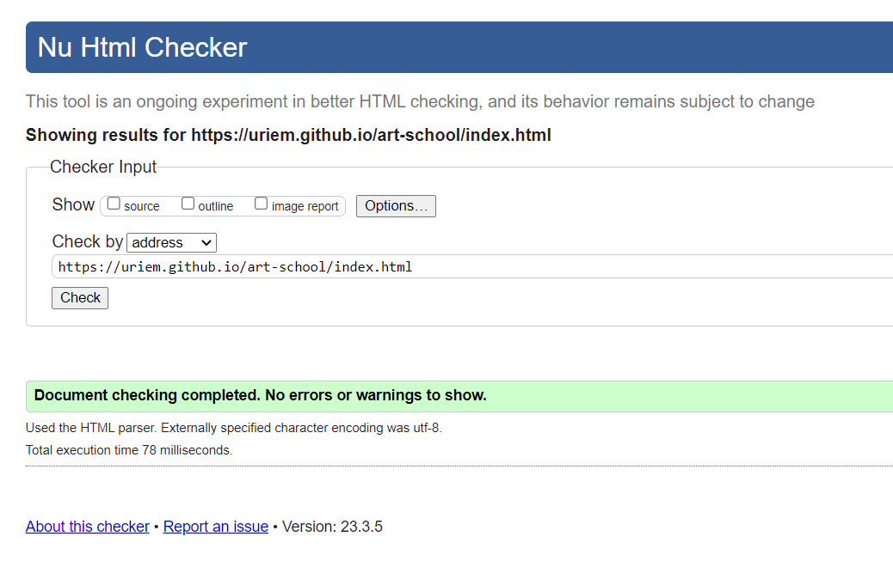

About

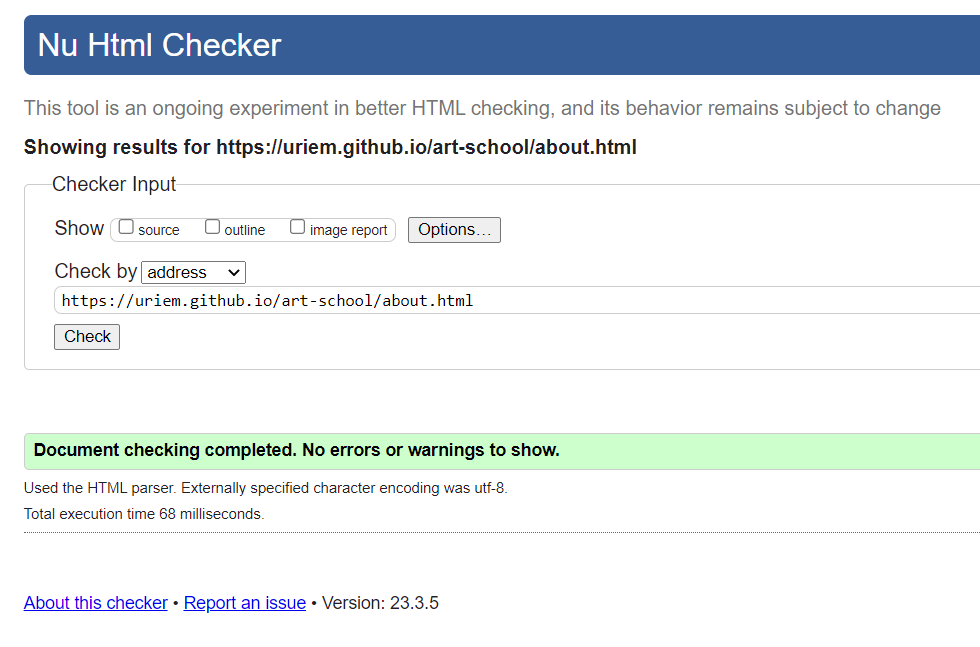

Gallery

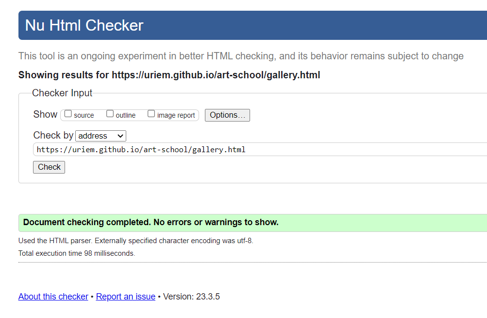

Contact

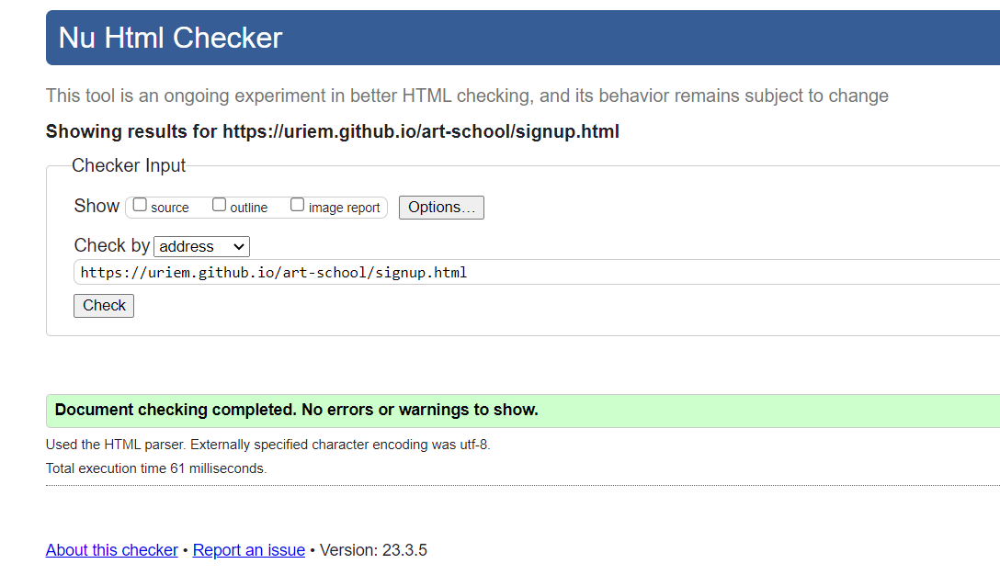

### CSS Validation

The W3C Jigsaw CSS Validation Service was used to validate the CSS of the website. The code passed with no errors or warnings.

CSS Validation Screenshot

### Accessibility & Performance

The Lighthouse feature on Google Devtools was used to assess accessibility and performance. 

Home

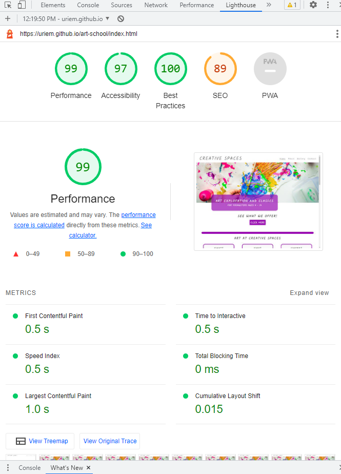

About

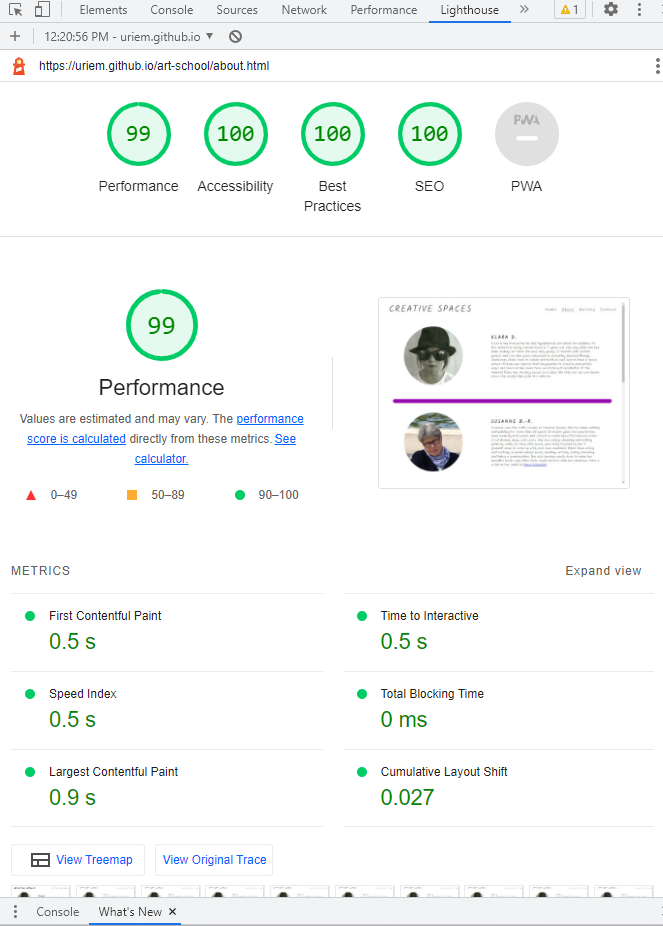

Gallery

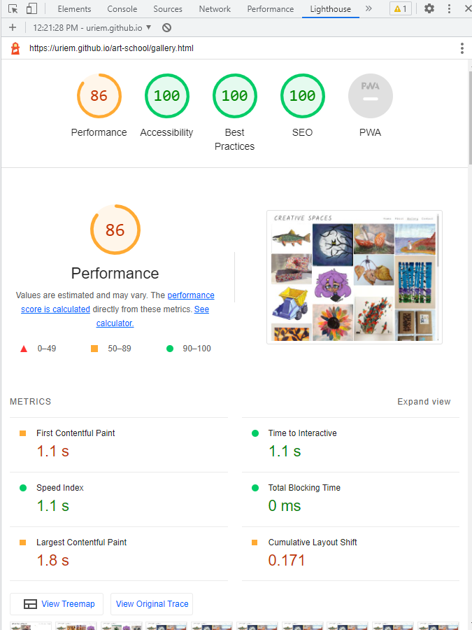

Contact

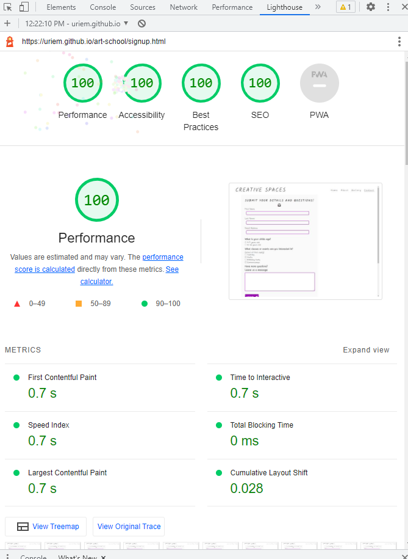

### Browser Compatability

The websites compatability was tested on the following browsers:

* Google Chrome
* Mozilla Waterfox
* Microsoft Edge

### User Stories

1. As a first time user, I want to know what services are offered at Creative Spaces.

| **Feature** | **Action** | **Expected Result** | **Actual Result** |
|-------------|------------|---------------------|-------------------|
| Home page | Navigate to the type of art activities you are most interested in | Locating information on activities offered | Works as expected |

2. As a first time user, I want to know times, location, and types of classes offered.

| **Feature** | **Action** | **Expected Result** | **Actual Result** |
|-------------|------------|---------------------|-------------------|
| Home page | Navigate to the type of art activities you are most interested in | See types of classes and times offered | Works as expected |
| Footer - address | Scroll down to the footer of the page | Find the address of the school | Works as expected |

3. As a first time user, I want to know how to get in contact with the business and request more information.

| **Feature** | **Action** | **Expected Result** | **Actual Result** |
|-------------|------------|---------------------|-------------------|
| Contact page | Navigate to the contact page and locate the form | Find and fill out contact form | Works as expected |
| Footer-social media links  | On any page scroll down to the footer | Contact via social media platform of your choice | Works as expected | 

4. As a first time user, I want to find more information about the staff mentoring and supervising the children.

| **Feature** | **Action** | **Expected Result** | **Actual Result** |
|-------------|------------|---------------------|-------------------|
| About page | Navigate to the about page | Find information on the staff and their classes | Works as expected |

5. As a first time user, I want to get a feel for what to expect from the classes and fascilities.

| **Feature** | **Action** | **Expected Result** | **Actual Result** |
|-------------|------------|---------------------|-------------------|
| About page | Navigate to the about page | Find information on the staff and their classes | Works as expected |
| Gallery page | Navigate to the gallery page | Find samples of work produced by teachers and students | Works as expected |

6. As a returning user, I want to see the times and types of classes offered.

| **Feature** | **Action** | **Expected Result** | **Actual Result** |
|-------------|------------|---------------------|-------------------|
| Home page | Navigate to the type of art activities you are most interested in | Locating information on activities offered | Works as expected |

7. As a returning user, I want to see if there is any new classes offered.

| **Feature** | **Action** | **Expected Result** | **Actual Result** |
|-------------|------------|---------------------|-------------------|
| Contact page | Navigate to the contact page and locate the form | Find and fill out contact form for more information | Works as expected |
| Footer-social media links  | On any page scroll down to the footer | See if new classes are advertised on social media | Works as expected | 

8. As a returning user, I want to find social media links to connect with the business.

| **Feature** | **Action** | **Expected Result** | **Actual Result** |
|-------------|------------|---------------------|-------------------|
| Footer-social media links  | On any page scroll down to the footer | Find social media links | Works as expected | 

9. As a returning user, I want to find directions to the location of the business.

| **Feature** | **Action** | **Expected Result** | **Actual Result** |
|-------------|------------|---------------------|-------------------|
| Footer-social media links  | On any page scroll down to the footer | Find address of the school | Works as expected | 

10. As the site owner, I want users to interact with the space, learn about the space, learn about the services offered, learn about the benefits of the service, and sign up for more information.

| **Feature** | **Action** | **Expected Result** | **Actual Result** |
|-------------|------------|---------------------|-------------------|
| Home page | Navigate to the type of art activities and philosophy section | Find information on activities offered and business motivation | Works as expected |
| Footer-social media links  | On any page scroll down to the footer | Contact via any social media platform | Works as expected | 
| Contact page | Navigate to the contact page and locate the form | Find and fill out contact form | Works as expected |
| About page | Navigate to the about page and read about staff backgrounds and classes they offer | Read the page | Works as expected |

11. As the site owner, I want users to feel comfortable and at ease reaching out for more information.

| **Feature** | **Action** | **Expected Result** | **Actual Result** |
|-------------|------------|---------------------|-------------------|
| Footer-social media links  | On any page scroll down to the footer | Contact via any social media platform | Works as expected | 
| Contact page | Navigate to the contact page and locate the form | Find and fill out contact form | Works as expected |

## Bugs, Fixes and Outstanding issues

| **Bug** | **Fix** |
| ----------- | ----------- |
| Bug | Fix |

### Outstanding Issues

## Deployment & Development

The website was deployed using GitHub Pages by following these steps:

1. In the GitHub respository navigate to the Settings tab.
2. Select Pages from the menu on the left-hand side of the page.
3. For the source select Branch: 'main' and then select: 'save'.
4. After the webpage refreshes automatically a ribbon at the top will displays the following message: "Your site is live at https://uriem.github.io/art-school/"

The website repository can be forked by the following steps:

1. Go to the GitHub repository.
2. Click on the Fork button in the upper right hand corner.

The repository can be cloned by the following steps:

1. Got to the GitHub repository.
2. Locade the Code button above the list of files and click on it.
3. Select if you prefer to clone using HTTPS, SSH, or Github CLI and click the copy button to copy the URL to your clipboard.
4. Open Git Bash.
5. Change the current working directory to the one where you want the cloned directory.
6. Type git clone and paste the URL from the clipboard ($ git clone https://github.com/YOUR-USERNAME/YOUR-REPOSITORY)
7. Press Enter to create your local clone.

## Credits

Images not referenced below are owned by the developer.

### Media

Images:
* Hero image by <a href="https://unsplash.com/@dragos126">Dragos Gontariu</a> on <a href="https://unsplash.com/photos/54VAb3f1z6w">Unsplash</a>
* Smiling girl by <a href="https://unsplash.com/@senjuti">Senjuti Kundu</a> on <a href="https://unsplash.com/photos/JfolIjRnveY">Unsplash</a>
* Pictures in the gallery attributed in the caption to Wiltrud Düll and her portrait shot on the About page were provided by her.
* Pictures in the gallery attributed in the caption to Susanne Buske-Riemenschneider and her portrait shot on the About page were provided by her.
* Pictures in the gallery attributed in the caption to Annika Riemenschneider-Melzer and her portrait shot on the About page were provided by her.

### Code
- The website was loosely modeled on and inspired by the Love Running Walkthough project and some of the code from the walkthrough project was used and adapted.
- Layout and code for the About page was modeled after and adapted from <a href="https://github.com/paulie-o74/paul_thomas_pt">Paul Thomas O'Rirodan's Project 1 Website</a>.
- <a href="https://www.w3schools.com/">W3 Schools</a> was a great help in creating the hover image overlay for captions on the gallery page.
- This README file was also guided by the README file from <a href="https://github.com/paulie-o74/paul_thomas_pt">Paul Thomas O'Rirodans Project 1 Website</a>.
- In an initial inception of this website the gallery layout code, both HTML and CSS, was taken from Saief Al Emon https://codepen.io/iamsaief/pen/jObaoKo. Ultimately however, it was changed significantly and the final layout returned to being a masonry style illustrated and used in the Love Running project.

### Acknoowledgements

I would like to thank:
- My mentor Brian O'Hare for his feedback, advice, guidance and support.
- My enthusiastic contributors of material, in the form of text and images, for the hypothetical art school for kids: My mother Susanne Buske-Riemenschneider, my sister Annika Riemenschneider-Melzer and family friend Wiltrud Düll. 
- Cohort fascilitator Paul Thomas O'Rirodan, for his general advice on the management of the course and pointing us to a plethora of resources to help with the projects.
- My husband, Matt, for his encouragement and support along the way.
